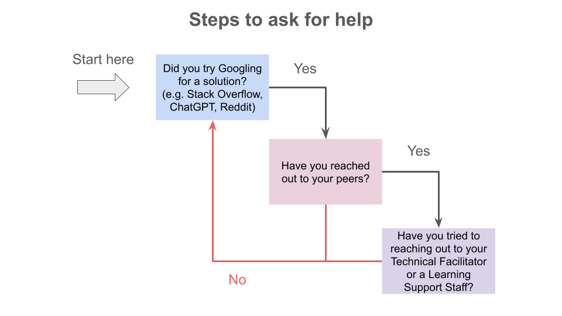

# Python
 
## Content

* [Description](#description)
* [Learning Outcomes](#learning-outcomes)
* [Assignments](#assignments)
* [Contacts](#contacts)
* [Delivery of the Learning Module](#delivery-of-the-learning-module)
* [Schedule](#schedule)
* [Requirements](#requirements)
* [Resources](#resources)
    + [Documents](#documents)
    + [Videos](#videos)
* [Folder Structure](#folder-structure)

## Description

This module introduces participants to the fundamentals of programming using Python. Participants will be introduced to the concepts of functions and object-oriented programming to make use of reusable blocks of code and models respectively. We also introduce `numPy`, an important library in data science and machine learning. By the end of this module, participants will be able to write reusable code to analyze data.

## Learning Outcomes

By the end of the module, participants will be able to:

1. Identify the differences between data types
2. Identify and resolve errors
3. Write a block of code as a reusable function
4. Use manual and automated testing to ensure block of code work as expected
5. Write blocks of code in Python using variables and conditionals
6. Use a loop to go over elements of an array
7. Describe the benefits of Object Oriented programming
8. Use the `numPy` library to perform mathematical operations on arrays and datasets

## Assignments

Participants should review the [Assignment Submission Guide](https://github.com/UofT-DSI/onboarding/blob/main/onboarding_documents/submissions.md) for instructions on how to complete assignments in this module.

There are two assignments (one per week) in this module:

1. [Anagram Checker](https://github.com/UofT-DSI/python/blob/main/02_assignments/assignment_1.ipynb): Due **Sunday May 5**
2. [Efficacy Analysis of a Hypothetical Arthritis Drug](https://github.com/UofT-DSI/python/blob/main/02_assignments/assignment_2.ipynb): Due **Sunday May 12**

## Contacts

**Questions can be submitted to the _#cohort-3-help_ channel on Slack**

* Technical Facilitator: 
  * **Kaylie Lau** (She/Her): kaylie.lau@mail.utoronto.ca
* Learning Support Staff: 
  * **Michaela Drouillard** (She/Her): michaela.drouillard@mail.utoronto.ca
  * **Julia Gallucci** (She/Her): julia.gallucci@mail.utoronto.ca
  * **Emma Teng** (She/Her): e.teng@mail.utoronto.ca

## Delivery of the Learning Module

This module will include live learning sessions and optional, asynchronous work periods. During live learning sessions, the Technical Facilitator will introduce and explain key concepts and demonstrate core skills. Learning is facilitated during this time. Before and after each live learning session, the instructional team will be available for questions related to the core concepts of the module. The Technical Facilitator will introduce concepts through a collaborative live coding session using the Python notebooks found under `/01_slides`. The Technical Facilitator will also upload live coding files to this repository for participants to revisit under `./06_cohort_three/live_code`.


Optional work periods are to be used to seek help from peers, the Learning Support team, and to work through the homework and assignments in the learning module, with access to live help. Content is not facilitated, but rather this time should be driven by participants. We encourage participants to come to these work periods with questions and problems to work through. 
 

Participants are encouraged to engage actively during the learning module. They key to developing the core skills in each learning module is through practice. The more participants engage in coding along with the instructional team, and applying the skills in each module, the more likely it is that these skills will solidify. 

## Schedule

||Day 1|Day 2|Day 3|Day 4|Day 5|
|---|---|---|---|---|---|
|Week 1|Live Learning Session 1 (Introduction, Data Types, Error)|Live Learning Session 2 (Functions, Testing, Strings, Converting Types, Input)|Live Learning Session 3 (Control Flow) |Work Period 1|Work Period 2|
|Week 2|Live Learning Session 4 (Control Flow, Reading/Writing)|Live Learning Session 5 (Object Oriented Programming, `numPy`)|Case Study|Work Period 3|Work Period 4|

While APIs are not covered in this course, you are encouraged to explore the slides at your own pace to deepen your understanding.
 
## Requirements

* Participants are not expected to have any coding experience; the learning content has been designed for beginners.
* Participants are encouraged to ask questions, and collaborate with others to enhance their learning experience.
* Participants must have a computer and an internet connection to participate in online activities.
* Participants must not use generative AI such as ChatGPT to generate code in order to complete assignments. It should be used as a supportive tool to seek out answers to questions you may have.
* We expect participants to have completed the instructions mentioned in the [onboarding repo](https://github.com/UofT-DSI/onboarding/).
* We encourage participants to default to having their camera on at all times, and turning the camera off only as needed. This will greatly enhance the learning experience for all participants and provides real-time feedback for the instructional team. 

## Resources

Feel free to use the following as resources:

### Documents

- [Cheatsheet](https://www.datacamp.com/cheat-sheet/getting-started-with-python-cheat-sheet)
  - [Direct to image](https://images.datacamp.com/image/upload/v1673614099/Python_Cheat_Sheet_for_Beginners_f939d6b1bb.png)
- [Interactive Cheatsheet](https://www.pythoncheatsheet.org/)
- [W3Schools](https://www.w3schools.com/python/)
- [Official Python Docs](https://docs.python.org/3.12/)

### Videos

- [Dictionaries](https://www.youtube.com/watch?v=u0yr9B3nH8c)
- [Loops](https://www.youtube.com/watch?v=dHANJ4l6fwA)
- [Function](https://www.youtube.com/watch?v=NSbOtYzIQI0)
- [Return vs print](https://www.youtube.com/watch?v=LWdsF79H1Pg)
- [OOP Part 1](https://www.youtube.com/watch?v=wfcWRAxRVBA)
- [OOP Part 2](https://www.youtube.com/watch?v=WOwi0h_-dfA)
- [NumPy Playlist](https://www.youtube.com/playlist?list=PLGZqdNxqKzfYVbCaAKTPHVjz-VjQtBzbl)

### How to get help



<hr>

## Folder Structure

```markdown
.
├── 01_slides
├── 02_assignments
├── 03_homework
├── 04_instructional_team
├── 05_data
├── README.md
└── steps_to_ask_for_help.png
```

* **slides:** Module slides as interactive notebooks (.ipynb files)
* **assignments:** Assignments
* **homework:** Homework to practice concepts covered in class
* **instructors:** This folder guides Technical Facilitators and the Learning Support team on teaching methodologies and content delivery.
* **data**: Contains all data associated with the module
* **README**: This file!
* .gitignore: Files to exclude from this folder, specified by the Technical Facilitator

